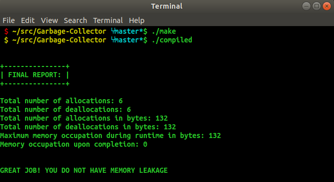
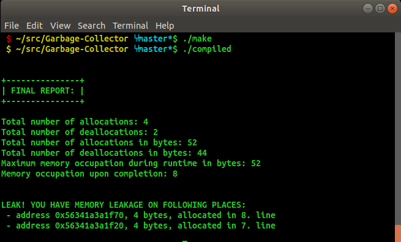

# Garbage-Collector
The idea is to implement our own
version of a smart pointer. You can think of this as implementing your own
garbage collector, to use a concept from other programming languages. This program is used to
verify that your implementation does not have any memory leaks!

#### Output
The output of this project should looks like this: (No Memory Leak)



If there's a memory leak, the output would look something like this:



# Building
To build this project, you will need a C++ compiler. The `make` script provided
assumes the GCC compiler, however you may substitute an equivalent C++ compiler
by adjusting the `make` script as needed. Execute the make script, then run the
compiled executable.

If the code fails to compile, the execute won't be created or will remain the
last-compiled version. Adjust your code to resolve compiler errors and try again.

``` shell
$ ./make
$ ./compiled
```

## Project TODO List:
- Complete `Pointer` constructor
- Complete `Pointer` `operator==`
- Complete `Pointer` destructor
- Complete `PtrDetails` class


## Overview of classes
The garbage collector utilizes three classes: Pointer, PtrDetails and Iterator. Let us talk about the purposes of each of these classes before analysing their code more in depth.

#### Pointer
The class Pointer is the fundamental class for the implementation of a garbage collector. The Pointer class upholds a list that affiliates a reference count with every memory block that is allocated to be used by a Pointer. Let us elaborate how this is done. Every time a Pointer points to a memory block, the reference count for that memory block is increased by 1. If the Pointer is then reassigned to point to another memory block, the reference count for the current block will be decremented, while the reference count for the new block is incremented. We can conclude that when a pointer is added to a memory block its reference count is increased, and likewise, when a pointer is removed, it is decreased. When the reference count becomes zero, that is when the memory can be deallocated.

Pointer is considered a template class and three operators are overloaded. The '*', '–>' and [] operators. Due to the way this class is implemented, Pointer can be used like a regular pointer.

Pointer does not implement the overloading arithmetic operators such as '++' or '--'. Later we will explain why they are not overloaded. Due to this restriction the only way a pointer can point to a specific memory block is by assigning the pointer to the block. These restrictions are solved through the implementation and usage of the Iterator class. The garbage collector works in situations where a Pointer goes out of scope. The garbage collector list is then traversed through, and any element that has a reference count equal to zero is deallocated. Garbage collecting can be activated explicitly as well whenever there is a need for it.

#### PtrDetails
So, as we said Pointer upholds a list that contains reference counts. Every element inside this list is encapsulated in a PtrDetails type object. PtrDetails holds the reference count of the element in a ref_cnt variable. PtrDetails has other variables as well. address is a pointer to the memory block. is_arr is a bool variable that tells us if there is an allocated array. It is false if it isn't. If it is, then it is set to true and the variable arr_size then holds the length of the allocated array.

#### The Iter Class
Memory to which Pointer is pointing to is accessed with the * and -> operators. The Iterator class allows us use pointer arithmetic. Iterator overloads all pointer operators necessary for pointer arithmetic. The purpose of Iterator is to traverse through the list elements of dynamically allocated arrays. Another purpose is for bound checking. An Iterator from Pointer is acquired by calling functions begin() and end().
